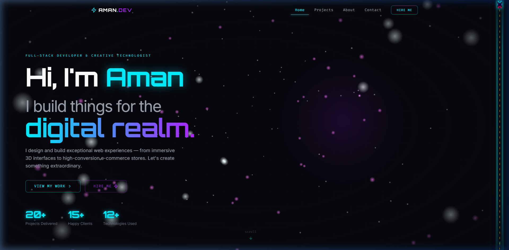
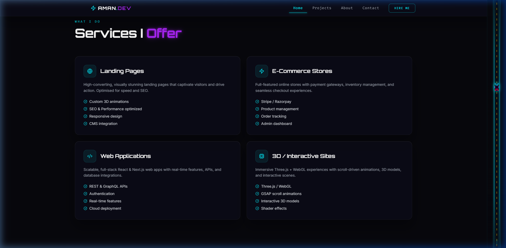
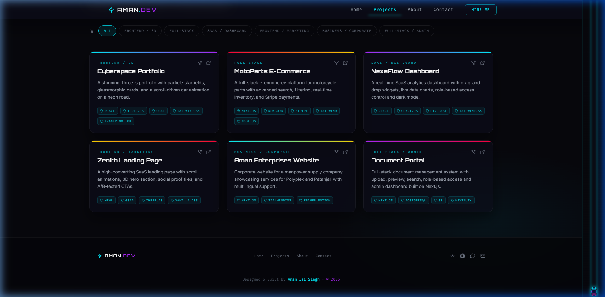
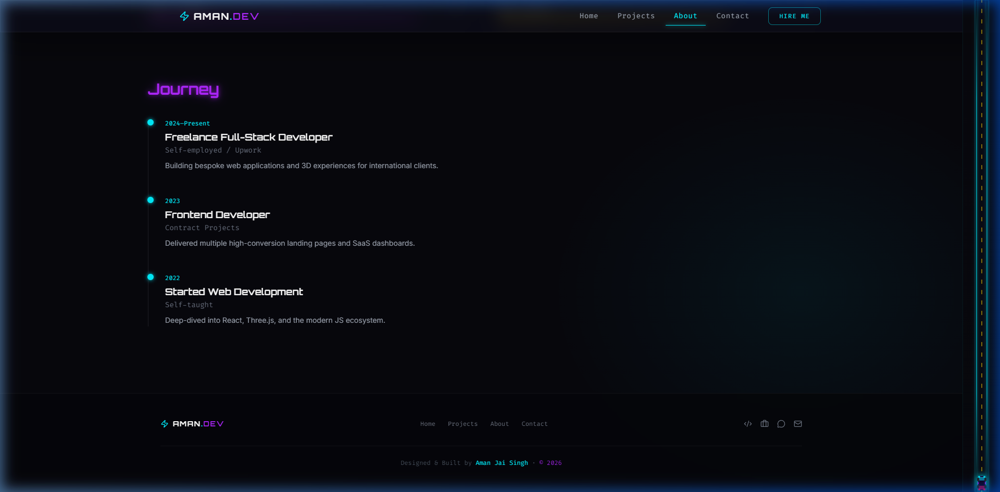
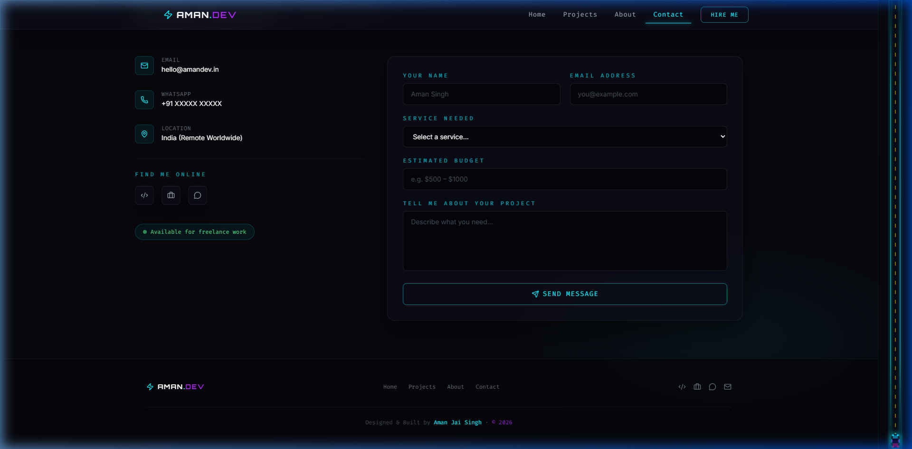

# Cyberspace Portfolio 🚀

A high-end, immersive 3D portfolio experience built with **React**, **Three.js**, and **GSAP**. Features a sleek cyberpunk aesthetic with glassmorphic UI elements and advanced particle systems.



## ✨ Features

- **Advanced 3D Backgrounds**: Multi-layered parallax orb system with custom glowing shaders.
- **Scroll-Driven Storytelling**: Interactive "Car on Road" scene that responds to your scroll position.
- **Multi-Page Architecture**: Seamless routing between Home, Projects, About, and Contact pages with Framer Motion transitions.
- **Full SEO Optimization**: Meta tags, Open Graph previews, and JSON-LD structured data for search engine visibility.
- **Animated Custom Cursor**: A premium, spring-animated pointer with trailing bokeh effects.
- **Responsive Design**: Tailored for all devices using Tailwind CSS.
- **Interactive UI**: Glassmorphic cards, neon-accented buttons, and smooth micro-animations.

## 🛠️ Tech Stack

- **Frontend**: React 19, Vite, Tailwind CSS
- **3D Engine**: Three.js, @react-three/fiber, @react-three/drei
- **Animation**: GSAP, Framer Motion
- **Icons**: Lucide React
- **Routing**: React Router 7

## 📸 Screenshots

| Home (Services) | Projects Page |
| :---: | :---: |
|  |  |

| About Me | Contact Page |
| :---: | :---: |
|  |  |

## 🚀 Getting Started

1. **Clone the repository**:
   ```bash
   git clone https://github.com/AmanJaiSingh/Aman.dev.git
   ```

2. **Install dependencies**:
   ```bash
   npm install
   ```

3. **Run the development server**:
   ```bash
   npm run dev
   ```

## 📄 License

Designed & Built by **Aman Jai Singh**. Free to use for personal inspiration.
